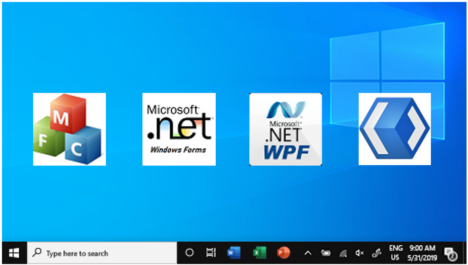
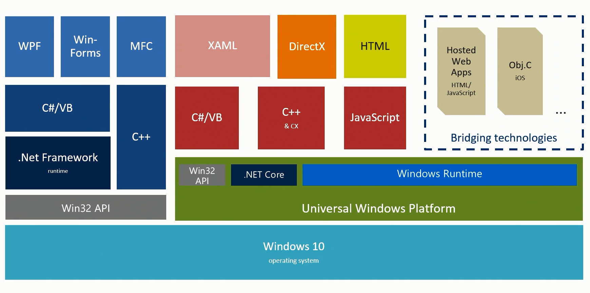
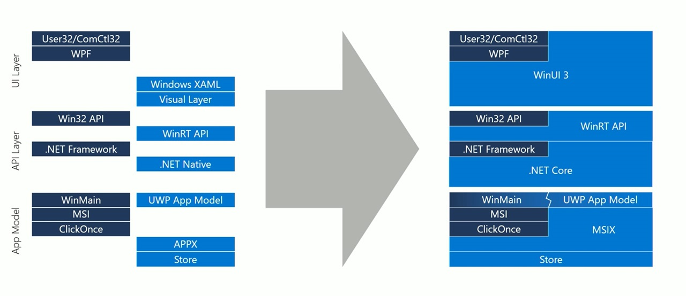

# Building Modern Desktop Apps using WinUI
Author: Sudhansu Sekhar Sutar

## Introduction
To promote develop of applications for Window operating system, Microsoft has introduced many different technologies (such as Win32, MFC, COM, ATL, Visual Basic, ActiveX, .Net, WinForms, WPF, Silverlight, WinRT/UWP, WinUI) during last 3 decades. Some of them are integral part of the Windows system now, some evolved to new, and a few deprecated. This article discuss some basics about windows app development, how to install the latest WinUI framework, and develop a Sample application using it.

## Platforms for Windows App Development
The four core platform Microsoft supports for application development are MFC, WinForms, WPF, and WinUI. Each of the platform provides an app model that defines the lifecycle of the app, a complete UI functional framework and set of UI controls to apps. 

MFC (Microsoft Foundation Class) – It gets you "closer to the metal," and lets you achieve the best performance for your app by taking direct control over memory allocation and performance oriented CPU features like SSE or AVX instructions. MFC provides a light non VM class abstraction over the Win32/COM Native API. The only supported language for MFC application development is VC++. MFC is suitable for write application like Word, Excel, Visio, photo shop, Windows System programs, Device Drivers, and Multimedia/Game development using DirectX.

WinForms (Windows Forms) – Windows Forms is the dominant RAD (Rapid Application Development) framework for building Windows smart client applications. It has initially introduced with .Net Framework 1.x. Windows Forms is easier to use and is a light weight UI model. Applications using WinForms can be developed using languages such as VC++/VB/C#. UI of some of the past version of Visual Studio (2000 ~ 2008) are developed using WinForms. It is a good choice of framework for development of business oriented desktop applications.

WPF (Windows Presentation Foundation) – WPF is the preferred technology for building Windows rich client applications that require UI complexity, styles customization, and graphics-intensive. It has a very powerful Templating, Styling, and data Binding capabilities with the support of XAML UI model. It has initially introduced with .Net Framework 3.x. Applications using WPF can be developed using languages such as VB/C#. UI of latest version of Visual Studio series (2010 ~ 2019) are developed using WPF.

WinUI (Windows UI Library) – The leading-edge framework for Windows apps development. It has originated as UX layer of UWP/WinRT platform, and finally decoupled as independent UX framework at Version 3.0. WinUI can be used in existing MFC, WinForms, or WPF apps to modernize them and gradually migrate, or develop complete WinUI based application from scratch for desktop or UWP. The supported languages are VC++/VB/C#/JS. WinUI uses XAML UI model, so code port possible among WPF, WinRT, UWP, and WinUI.

## Windows Development Target
There are two kinds of applications windows supports “1. Full Trust Win32/Desktop” Application, and “2-WinRT/UWP Sandboxed” application. A “Full Trust Win32/Desktop” app can also be sandboxed using the bridge technology.

 
## UWP Bridge Technology
UWP Bridges translate calls in other application programming interfaces (APIs) to the UWP interface, so that applications written in these APIs would run on UWP. Bridges available to run Android, iOS, Windows desktop apps, Microsoft Silverlight, and progressive web apps on UWP.

## Microsoft Project Reunion
Project Reunion is an umbrella project that makes it easier to build a great Windows app by providing a unified platform for new and existing Win32 and UWP apps. It will unify access to existing Win32 and UWP APIs and make them available decoupled from the OS. Some of the components of project reunion are: WinUI3, WebView2, MSIX, and Modern Resource Tooling.

## Modern Windows API Stacking

## Language Selection for Development

